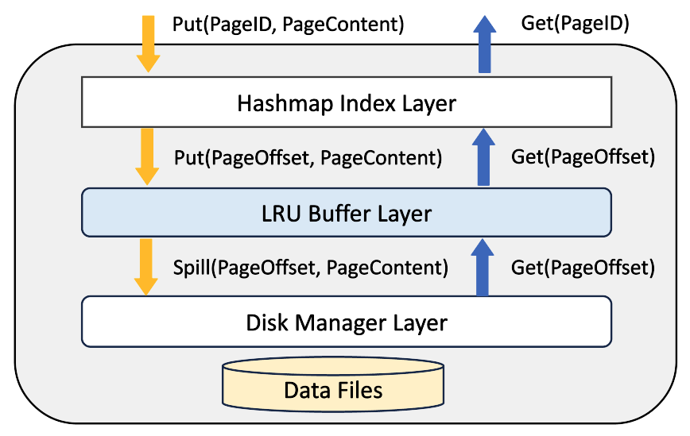

# Concurrent Light Weighted Key-Value Store

This Key-Value Store(KV-store) is implemented for SIGMOD 2024 revision. 
It is specially implemented as Cloud-Native database's storage engine. It supports heavy workload multi-thread concurrently getting and putting pages.

## 1. Architecture



This KV-store has three layers. 

### 1.1 Index Layer (Concurrent HashMap)
The first layer is an index layer. It's implemented by a concurrent hashmap, which using pthread_rw_lock to avoid threads conflictions. It will interact with caller functions.

There are three APIs to communicate with outer programs: GetValue(), InsertKVPair(), DeleteValue().

GetValue() will receive a key-value pair (pageID->pageContnet). But this layer will only store page's metadata in this map, which key is pageID and value is pageOffset in the disk files. The actual pages will be hold by buffer layer and disk layer.

This layer will works as a pure index. For the GetValue() requests, it will check whether this pageID exists in index, if not, just return false. Otherwise, it will find target page's offset, and try to fetch page from buffer layer. 

This layer won't interact with disk layer. It will try to fetch all pages from buffer, if the target pages are not cached in buffer, the buffer layer will automatically fetch them from disk. 

InsertKVPair() aims to store a new page or update an existed page in KV-store. If the coming page is existed, it will transfer this page to buffer pool to update this page. If the coming page is not existed, it will let the buffer layer allocate a file space (logical allocation) for this page.
After that, the index layer will store the pageID->pageOffset pair in its index, and let buffer pool caches this page.

### 1.2 Bufferr Pool Layer (Multi-threads safe LRU Cache)

Buffer pool layer will temporarily cache the hot page in the memory. It's implemented upon a LRU cache. 

From the LRU layer perspective, this buffer pool layer works 
as a file system. The index layer will send the newly coming pages to buffer pool layer, and buffer pool layer will allocate space to accommodate these pages by evicting 
cold pages. And the index layer will read pages from buffer pool layer. If the target page is not cached in buffer pool layer, it will fetch this page from disk layer.


### 1.3 Disk Manager Layer (Auto-Vacuum Disk Manager)

Disk manager layer's primary responsibility is to store pages in the specific offset, and fetch pages from the specific offset.
And disk manager will also provide available offset to accommodate new pages. Disk manager will automatically divide the storage into several segments, and each
segment space is 16MB. Disk manager will also reuse the space of deleted pages. It will
link all deleted pages' offsets into freelist, and reuse these offsets to store new pages.

## 2. Code Structure
```
Root Folder
├── includes                               # Underlying classes and interfaces
│   ├── concurrent_hashmap                 # Index layer folder
│   │   ├── concurrent_hashmap.h           # Concurrent hashmap class
│   │   ├── concurrent_hashmap_bucket.h    # Hashmap bucket class, contained by hashmap class
│   │   ├── concurrent_hashmap_node.h      # Hashmap node class, contained by hashmap bucket class
│   │   ├── concurrent_hashmap_bucket.cpp  # Implementation of hashmap bucket class
│   │   ├── concurrent_hashmap_node.cpp    # Implementation of hashmap node class
│   │   ├── concurrent_hashmap.cpp         # Implementation of hashmap class
│   ├── concurrent_lru_buffer_pool         # Buffer pool layer folder
│   │   ├── concurrent_lru_buffer_pool.h   # Concurrent LRU cache class
│   │   ├── lru_node.h                     # LRU node class, contained by LRU cache class
│   │   ├── lru_node.cpp                   # Implementation of LRU node class
│   │   ├── concurrent_lru_buffer_pool.cpp # Implementation of LRU cache class
│   ├── disk_manager                       # Disk manager layer folder
│   │   ├── disk_manager.h                 # Disk manager class
│   │   ├── disk_manager.cpp               # Implementation of disk manager class
│   ├── light_weighted_kvstore             # Implement Necessary Interfaces for KV-store
│   │   ├── light_weighted_kvstore.h       # KV-store class
│   │   ├── light_weighted_kvstore.cpp     # Implementation of KV-store class
├───c_compatible_api                       # API to make it compatible with C language
│   ├── light_weighted_kvstore_api.h       # Header file to be included in C language
│   ├── light_weighted_kvstore_api.cpp     # Implementation of C language API
├───unit_test_$class_name                  # Unit test files for each class
...
```

## 3. Setup
### 3.1 Compile
```
make
```

```
Output:
g++ -c unit_test_concurrent_hashmap.cpp -o unit_test_concurrent_hashmap.o
g++ -c unit_test_concurrent_lru_buffer_pool.cpp -o unit_test_concurrent_lru_buffer_pool.o
g++ -c unit_test_light_weighted_kvstore.cpp -o unit_test_light_weighted_kvstore.o
g++ -c unit_test_disk_manager.cpp -o unit_test_disk_manager.o
g++ -c main.cpp -o main.o
g++ -o unit_test_check main.o concurrent_hashmap.o concurrent_hashmap_bucket.o concurrent_hashmap_node.o concurrent_lru_buffer_pool.o lru_node.o disk_manager.o light_weighted_kvstore.o light_weighted_kvstore_api.o unit_test_concurrent_hashmap.o unit_test_concurrent_lru_buffer_pool.o unit_test_light_weighted_kvstore.o unit_test_disk_manager.o
```

### 3.2 Compile Static Library
With this command, this project will generate a static library *libkvstore.a*, which is the recommended way to use this project.
```
make static
```
```
Output:
ar -r libkvstore.a *.o
ar: creating libkvstore.a
```

To be compatible with C language, we provided a header file ("c_compatible_api/light_weighted_kvstore_api.h"). For usage, first copy this header file into your project. While compiling your own project, you should append the following command to your CFLAGS
```
gcc -o main $ProgramName -L. -lkvstore -lstdc++
```

### 3.3 Unit Test
For unit test, compile this project with command:
```
make unit_test
```
```
Output:
g++ -c unit_test_concurrent_hashmap.cpp -o unit_test_concurrent_hashmap.o
g++ -c unit_test_concurrent_lru_buffer_pool.cpp -o unit_test_concurrent_lru_buffer_pool.o
g++ -c unit_test_light_weighted_kvstore.cpp -o unit_test_light_weighted_kvstore.o
g++ -c unit_test_disk_manager.cpp -o unit_test_disk_manager.o
g++ -c main.cpp -o main.o
g++ -o unit_test_check main.o concurrent_hashmap.o concurrent_hashmap_bucket.o concurrent_hashmap_node.o concurrent_lru_buffer_pool.o lru_node.o disk_manager.o light_weighted_kvstore.o light_weighted_kvstore_api.o unit_test_concurrent_hashmap.o unit_test_concurrent_lru_buffer_pool.o unit_test_light_weighted_kvstore.o unit_test_disk_manager.o
```
It will generate a "unit_test_check" file which will execute unit test cases.
```
./unit_test_check
```
```
Output:
Start running all test cases
concurrent_hashmap test_case0 passed
concurrent_hashmap test_case1 passed
concurrent_hashmap test_case2 passed
concurrent_hashmap test_case3 passed
concurrent_hashmap test_case4 passed
concurrent_hashmap test_case5 passed
concurrent_hashmap test_case6 passed
disk_manager test_case0 passed
disk_manager test_case1 passed
concurrent_lru_buffer_pool test_case0 passed
light_weighted_kvstore test_case0 passed
light_weighted_kvstore test_case1 passed
light_weighted_kvstore test_case2 passed
```
